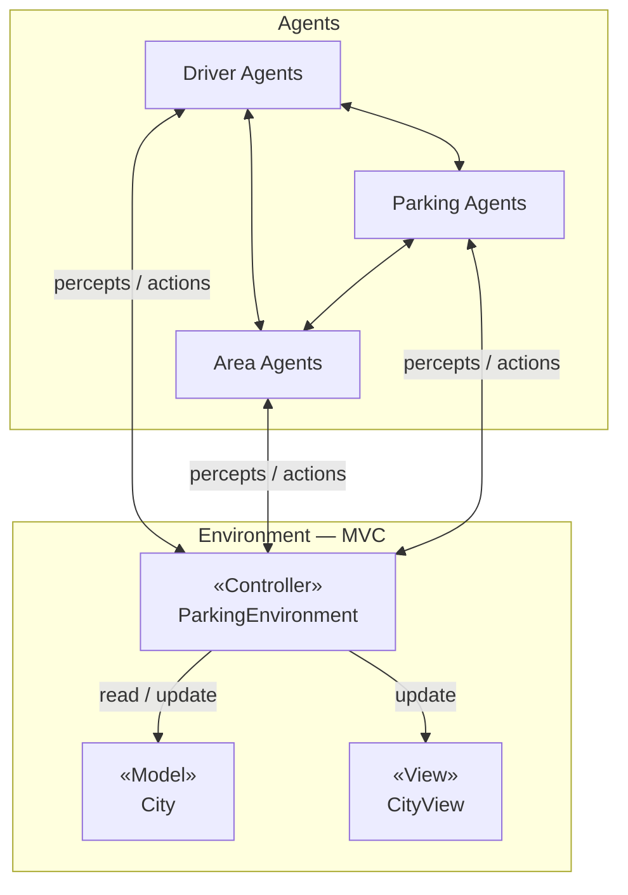
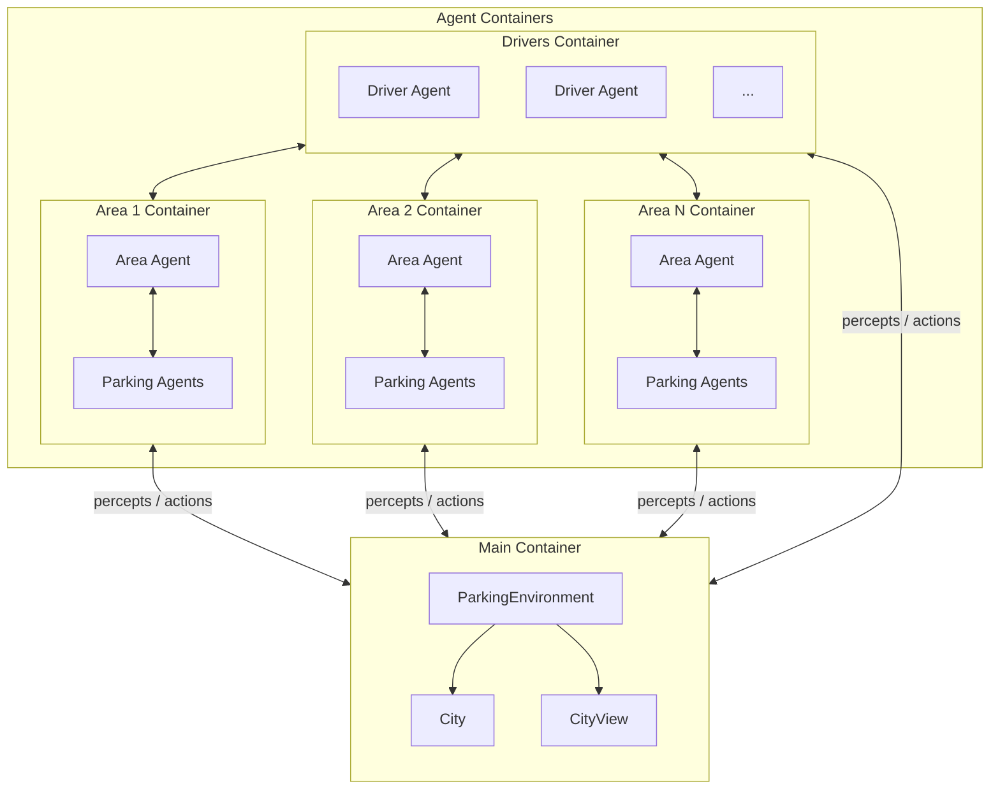

# Design

## Architecture

```mermaid
flowchart TB
    subgraph MAS["Agents"]
        D["Driver Agents"]
        A["Area Agents"]
        P["Parking Agents"]

        D <--> A
        D <--> P
        P <--> A
    end

    subgraph MVC["Environment — MVC"]
        C["«Controller»<br/>ParkingEnvironment"]
        M["«Model»<br/>City"]
        V["«View»<br/>CityView"]

        C -->|"read / update"| M
        C -->|"update"| V
    end

    D <-->|"percepts / actions"| C
    A <-->|"percepts / actions"| C
    P <-->|"percepts / actions"| C
```

## Infrastructure

```mermaid
flowchart TB

subgraph MAIN["Main Container"]
    direction TB
    PE["ParkingEnvironment"]
    M["City"]
    V["CityView"]
    PE --> M
    PE --> V
end

    subgraph AGENTS["Agent Containers"]
        direction LR

        subgraph A1["Area 1 Container"]
            direction TB
            A1A["Area Agent"]
            A1P["Parking Agents"]
            A1A <--> A1P
        end
        
        subgraph A2["Area 2 Container"]
            direction TB
            A2A["Area Agent"]
            A2P["Parking Agents"]
            A2A <--> A2P
        end

        subgraph AN["Area N Container"]
            direction TB
            ANA["Area Agent"]
            ANP["Parking Agents"]
            ANA <--> ANP
        end

        subgraph D["Drivers Container"]
            direction TB
            DA1["Driver Agent"]
            DA2["Driver Agent"]
            DAN["..."]
        end
        
        D <--> A1
        D <--> A2
        D <--> AN
    end

    A1 <-->|"percepts / actions"| MAIN
    A2 <-->|"percepts / actions"| MAIN
    AN <-->|"percepts / actions"| MAIN
    D <-->|"percepts / actions"| MAIN
```