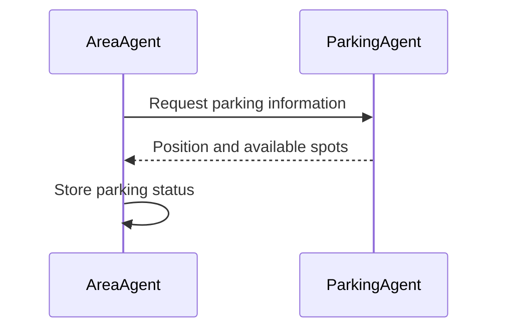
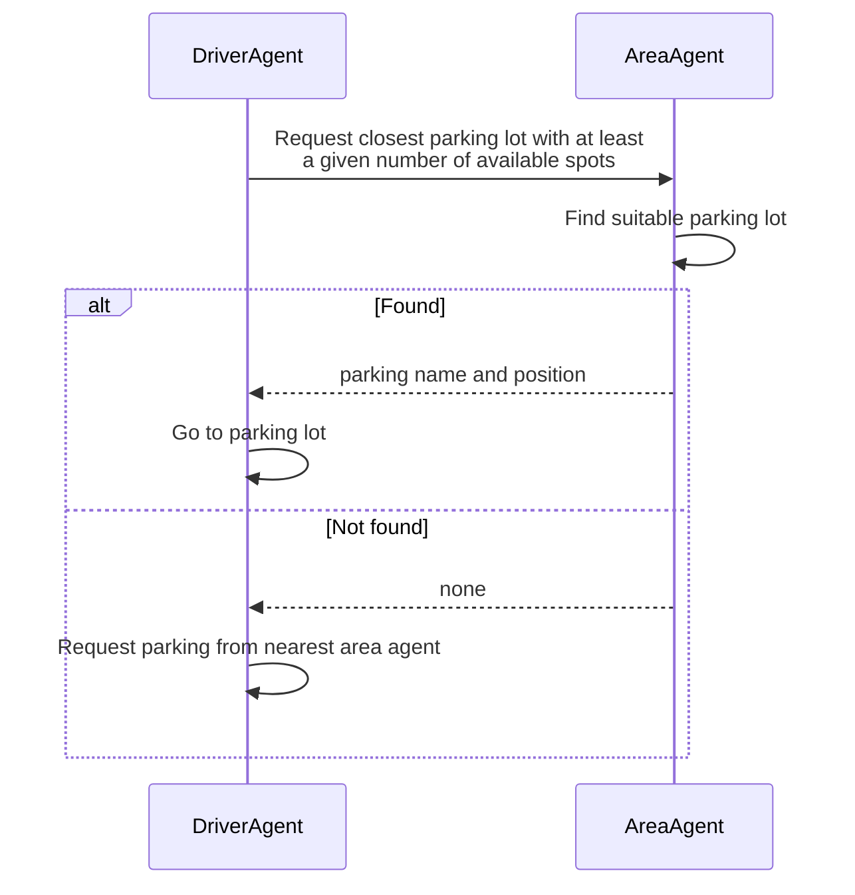
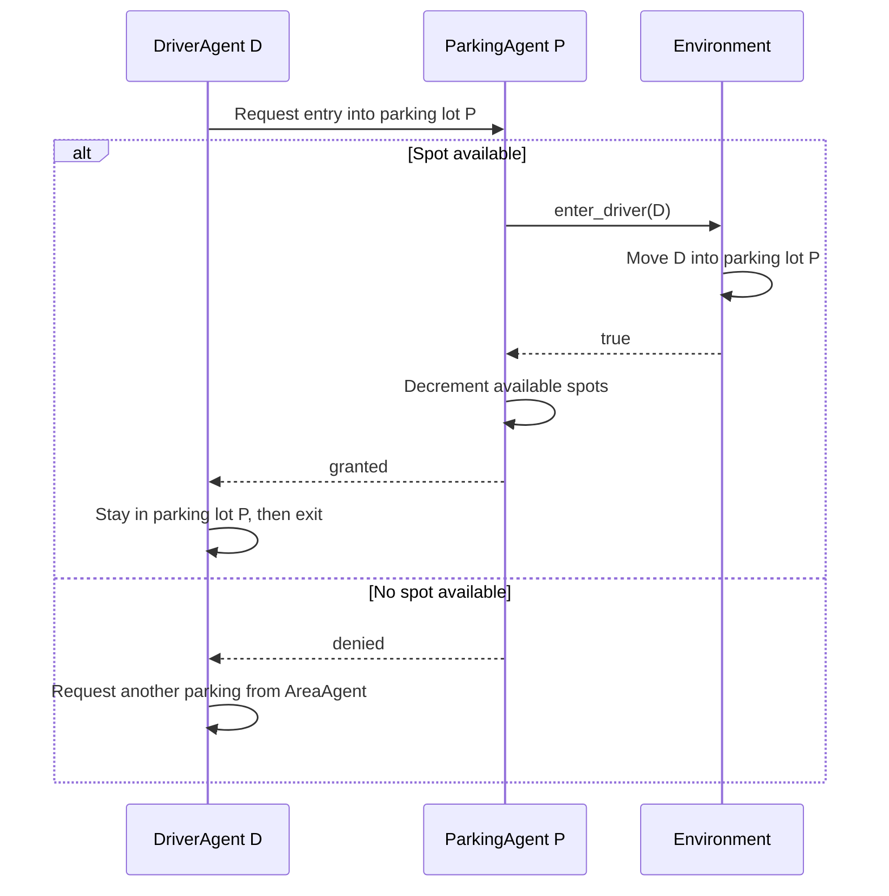
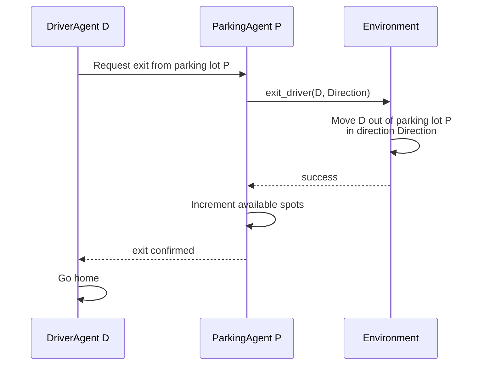
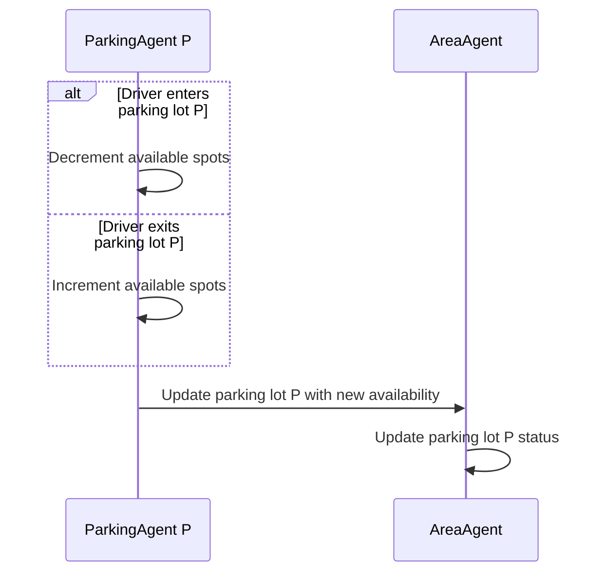

# Inter-Agent Communication

## AreaAgent - ParkingAgent: initial information collection

## DriverAgent - AreaAgent: request parking

## DriverAgent - ParkingAgent: parking entry

## DriverAgent - ParkingAgent: parking exit

## ParkingAgent - AreaAgent: parking availability updates
